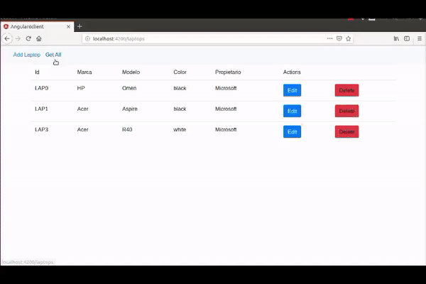

# HF-Tutorial
[](https://opensource.org/licenses/MIT)
[](https://www.codacy.com/app/antonioalfa22/HF-Tutorial?utm_source=github.com&amp;utm_medium=referral&amp;utm_content=antonioalfa22/HF-Tutorial&amp;utm_campaign=Badge_Grade)


Tutorial para poder crear una red blockchain Hyperledger Fabric junto con un cliente Angular que se conecta con la red mediante una API Rest.


 


- [HF-Tutorial](#hf-tutorial)
    - [1.- Prerrequisitos:](#1--prerrequisitos)
        - [1.1 .- Docker y Docker-Compose](#11---docker-y-docker-compose)
        - [1.2 .- Go](#12---go)
        - [1.3 .- NodeJS Runtime y NPM](#13---nodejs-runtime-y-npm)
    - [2.- Clonar el repositorio](#2--clonar-el-repositorio)
    - [3.- Imágenes Docker de Fabric y Ejecutables:](#3--im%C3%A1genes-docker-de-fabric-y-ejecutables)
    - [5.- Crear canal, unir organizaciones e instanciar chaincode:](#5--crear-canal-unir-organizaciones-e-instanciar-chaincode)
    - [6.- Registrar Admin y un usuario:](#6--registrar-admin-y-un-usuario)
    - [7.- Iniciar servidor y API Rest:](#7--iniciar-servidor-y-api-rest)
    - [8.- Cliente Angular:](#8--cliente-angular)

## 1.- Prerrequisitos:
Antes de poder comenzar a configurar nuestra red Fabric necesitamos instalar los prerrequisitos en las máquinas que queramos utilizar para el desarrollo de la aplicación.
Puedes ver más información sobre los prerrequisitos [aquí](https://hyperledger-fabric.readthedocs.io/en/release-1.3/prereqs.html).

### 1.1 .- Docker y Docker-Compose
Deber de tener instalado tanto Docker versión 17.06 o mayor como Docker Compose versión 1.14.0 o mayor:

Podemos comprobar que Docker está instalado con el comando: 
```bash
$ docker --version
```

Podemos comprobar que Docker-Compose está instalado con el comando: 
```bash
$ docker-compose --version
```

### 1.2 .- Go
Necesitamos tener instalado el lenguaje Go ya que Hyperledger utiliza dicho lenguaje para muchos de sus componentes.

Además debes añadir la variable de entorno GOPATH apuntando al workspace de Go:
```bash
$ export GOPATH=$HOME/go
``` 

### 1.3 .- NodeJS Runtime y NPM
Si vas a desarrollar aplicaciones con Hyperledger Fabric con NodeJS también necesitas instalar NodeJS versión 8.9.X o superior (la versión 9.x aún no tiene soporte) junto con npm.

Normalmente al instalar NodeJS viene incluido NPM, pero es recomendable confirmar la versión de NPM instalada. Puedes actualizar NPM con el siguiente comando:
```node
$ npm install npm@5.6.0 -g
```

## 2.- Clonar el repositorio
Ahora debes clonar este repositorio donde hay una plantilla con los archivos necesarios para crear una red Fabric.

```bash
$ git clone https://github.com/antonioalfa22/HF-Tutorial.git
$ cd HF-Tutorial
```

## 3.- Imágenes Docker de Fabric y Ejecutables:
El siguiente paso es descargar la última versión de las imágenes Docker de Hyperledger Fabric y añadirles la etiqueta de `latest`. Ejecuta el siguiente comando para descargar dichos archivos.

```bash
$ curl -sSL http://bit.ly/2ysbOFE | bash -s 1.3.0
$ sudo apt install libtool libltdl-dev
$ go get github.com/miekg/pkcs11
```

> Es recomendable que la máquina en uso no tenga otras imágenes de Docker de Hyperledger Fabric ya que puede dar lugar a errores. Puedes borrar todas las imagenes de Docker con los siguientes comandos:
> ```bash
> $ docker rm -f $(docker ps -aq)
> $ docker rmi -f $(docker images -q)
> ```

Una vez descargadas las imágenes Docker, tenemos que asegurarnos que estén en su última version (`latest`). Si ejecutamos `$ docker images` deberíamos de tener una salida parecida a esta:
 

 Si alguna imágen Docker no tiene la etiqueta `latest` puedes añadirla con el siguiente comando:

 ```bash
 $ docker tag hyperledger/<name_image>:<tag> hyperledger/fabric-tools:latest
 ```

 Además de las imágenes Docker se ha descargado una carpeta bin que contiene los ejecutables necesarios para instanciar una red Fabric, como `cryptogen, configtxgen, configxlator, peer`. Ahora debemos de añadir la carpeta bin a nuestra variable de entorno PATH:

 ```bash
 $ cd fabric-samples
 $ export PATH=$PWD/bin:$PATH
 ```

 ## 4.- Primera ejecución:
 Una vez hayas completado todo lo anterior sin problemas, vamos a iniciar por primera vez nuestra red Fabric. Para ello nos situamos en la raíz del repositorio y ejecutamos:

 ```bash
 $ ./hfNetwork.sh start
 ```

 Esto genera todos los certificados y llaves (keys) para nuestras diversas entidades de la red Fabric, incluyendo el genesis block que se usa para iniciar el ordering service y las transacciones necesarias para crear un canal.

Una vez generados los certificados vamos a inicia la red:

Si todo ha salido bien deberíamos de tener levantada nuestra red Fabric.

> Para "apagar" la red debemos ejecutar:
> ```bash
> $ ./hfNetwork.sh clean
> ```

Si todo ha salido bien, al hacer `docker ps` deberíamos tener una salida parecida a la siguiente:

```bash
CONTAINER ID        IMAGE                        COMMAND                  CREATED             STATUS              PORTS                              NAMES
b3ad8c954de2        hyperledger/fabric-tools     "/bin/bash"              7 seconds ago       Up 6 seconds                                           cli
7fa28abb6525        hyperledger/fabric-ca        "sh -c 'fabric-ca-se…"   17 seconds ago      Up 11 seconds       0.0.0.0:7054->7054/tcp             ca_peerMicrosoft
495c1b48f730        hyperledger/fabric-peer      "peer node start"        17 seconds ago      Up 7 seconds        0.0.0.0:7051-7053->7051-7053/tcp   peer0.microsoft.antonio.com
1ba5aade9f72        hyperledger/fabric-peer      "peer node start"        17 seconds ago      Up 8 seconds                                           peer0.apple.antonio.com
c37a065d00c6        hyperledger/fabric-ca        "sh -c 'fabric-ca-se…"   17 seconds ago      Up 10 seconds       0.0.0.0:8054->7054/tcp             ca_peerApple
1360d36e2ee8        hyperledger/fabric-orderer   "orderer"                17 seconds ago      Up 9 seconds        0.0.0.0:7050->7050/tcp             orderer.antonio.com

```

## 5.- Crear canal, unir organizaciones e instanciar chaincode:
Cuando tengamos levantada la red Fabric, procederemos a crear un canal con nombre `laptopschannel` y haremos que las dos organizaciones `Microsoft` y `Apple` se unan a él.

Para ello primero tenemos que ejecutar los siguientes comandos en orden:

```bash
./hfNetwork.sh cli 
./scripts/01-createchannel.sh //Se crea el canal
./scripts/02-joinApple.sh // Se une la organización Apple al canal
./scripts/03-joinMicrosoft.sh // Se une la organización Microsoft al canal
./script/04-installApple.sh // se instala el chaincode en el peer de Apple
./script/05-installMicrosoft.sh // se instala el chaincode en el peer de Microsoft
./script/06-instanciate.sh // Se instancia el smart contract
./script/07-init.sh
```

## 6.- Registrar Admin y un usuario:
Para registrar un administrador primero necesitamos instalar las dependencias necesarias:

```node
npm install
```

Una vez hecho esto procedemos a registrar al administrador:
```node
node registerAdmin.js
```
> En caso de que dicho comando nos devuelva un error, puede ser debido a que no encuentra la adminPrivateKey. Para ello editamos dicha variable en `config/ConnectionProfile.yml` y le damos como valor el nombre del archivo situado en: `\crypto-config\peerOrganizations\microsoft.antonio.com\users\Admin@microsoft.antonio.com\msp\keystore`

Una vez registrado el admin, podemos registrar nuestro primer usuario llamado user1:

```node
node registerUser.js
```

## 7.- Iniciar servidor y API Rest:

Ahora solo nos queda levantar el servidor NodeJS con nuestra API Rest:

```node
npm start
```

Puedes realizar peticiones para interactuar con la red, como peticiones POST, GET y PUT. Las operaciones disponibles son:

- **Obtener todos los laptops**: GET `/api/laptops`
- **Obtener un laptop dado su id**: GET `/api/laptop/id`
- **Añadir laptop**: POST `/api/laptop`
    - Body:
        - marca
        - modelo
        - color
        - propietario
- **Editar laptop**: PUT `/api/laptop`
    - Body:
        - id
        - marca
        - modelo
        - color
        - propietario


## 8.- Cliente Angular:
En caso de que queramos conectarnos con la red Fabric de manera mas visual e interactiva podemos clonar mi repositorio de Agular7_HF_Client y usar el cliente.

```bash
git clone https://github.com/antonioalfa22/Angular7_HF_Client

cd Angular7_HF_Client
npm install -g @angular/cli
npm install
npm start
```
